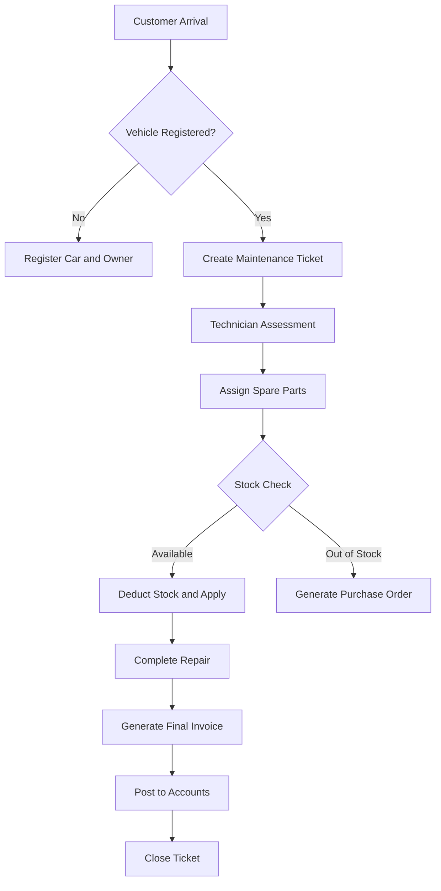

# 🛠️ AutoParts & Maintenance Management System (POS)

  
  
  


---

## 📌 Overview

A **Professional Enterprise-Grade Point of Sale & Maintenance Management System** designed specifically for:

- Automotive Service Centers  
- Spare Parts Retailers  
- Car Maintenance Workshops  

The system provides **real-time inventory tracking**, **maintenance lifecycle management**, and **accurate financial accounting** — all in one integrated platform.

---

## 🧰 Built Using

- ASP.NET Core 6 MVC  
- Entity Framework Core  
- SQL Server  
- Razor Views  
- Bootstrap 5  

---

## 🎯 Project Goals

✔ Automate maintenance workflow  
✔ Prevent inventory errors  
✔ Provide accurate accounting & invoicing  
✔ Improve workshop productivity  
✔ Deliver enterprise-level reliability  

---

## 🔄 System Workflow



---

## 🧠 Core Business Logic

### 📦 Inventory Protection
- Automatic stock validation  
- Prevent ticket closure if stock is insufficient  

### 💰 Dynamic Invoice Calculation

```
Total Invoice =
(Spare Parts Total)
+ Workmanship Fees
- Discounts
```

### 🔒 Transaction Safety
- EF Core Transactions  
- Stock deducted only after payment is saved successfully  

---

## 🌟 Key Features

---

### 🚘 Maintenance & Vehicle Management

- Full Maintenance Lifecycle Tracking  
- Vehicle History via VIN or License Plate  
- Maintenance Logs  
- Real-Time Status Tracking  

Statuses:
- Pending  
- In Progress  
- Waiting Parts  
- Ready for Pickup  
- Completed  

---

### 📦 Inventory & Warehouse Control

- Real-Time Stock Updates  
- Automatic Deduction After Sales  
- Low Stock Alerts  
- Smart Filtering  

Filter By:
- Brand  
- Model  
- Part Type  

---

### 💰 Accounting & POS

- Professional Invoices  
- PDF Ready Printing  
- Profit Reports  
- Secure User Sessions  

---

## 🏗️ System Architecture

- Clean Architecture  
- Repository Pattern  
- Service Layer Pattern  
- Dependency Injection  
- EF Core  

---

## ⚙️ Installation Guide

---

### 1️⃣ Clone Repository

```bash
git clone https://github.com/Mohamekhaled550/AutoPartsPOS.git
cd AutoPartsPOS
```

---

### 2️⃣ Install Dependencies

```bash
dotnet restore
```

OR

```bash
dotnet add package Microsoft.EntityFrameworkCore.SqlServer
dotnet add package Microsoft.EntityFrameworkCore.Design
dotnet add package Microsoft.EntityFrameworkCore.Tools
```

---

### 3️⃣ Database Setup

#### Restore Backup

1. Open SQL Server Management Studio  
2. Connect to:

```
.\SQLEXPRESS
```

3. Restore Database from project `.bak` file  
4. Update connection string inside:

```
appsettings.json
```

---

### 4️⃣ Run Project

```bash
dotnet run
```

---

## 🚀 Deployment

### Publish Standalone EXE

```bash
dotnet publish -c Release -r win-x64 --self-contained true -p:PublishSingleFile=true -p:IncludeNativeLibrariesForSelfExtract=true
```

Output Path:

```
/bin/Release/net6.0/win-x64/publish/
```

---

## 📂 Project Structure

```
/Controllers
/Data
/Models
/Services
/Views
/wwwroot
```

---

## 🛡️ Security Features

- Session Encryption  
- Role-Based Authorization  
- Secure Transactions  
- Protected Connection Strings  

---

## 📊 Reports & Analytics

- Daily Revenue  
- Monthly Profit  
- Spare Parts Usage  
- Technician Performance  

---

## 🧪 Trial & Licensing

### Trial Version
- 3 Days Trial  
- Controlled via:

```
%AppData%/sys_config.data
```

---

### Commercial License
Contact Developer for Activation.

---

## 👨‍💻 Developer

**Mohamed Khaled**

📱 WhatsApp: +20 1092320944  
📧 Email: Hamok550@gmail.com  

---

## ❤️ Support

If you like this project:

⭐ Star the repo  
🍴 Fork it  
📢 Share it  

---

## 📜 License

Private Commercial License – Contact Developer.
